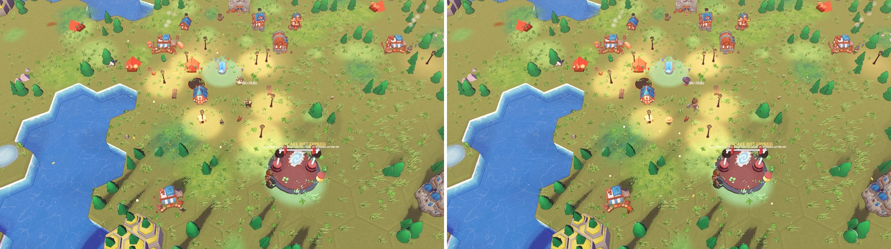
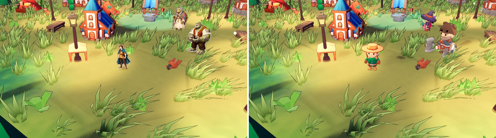
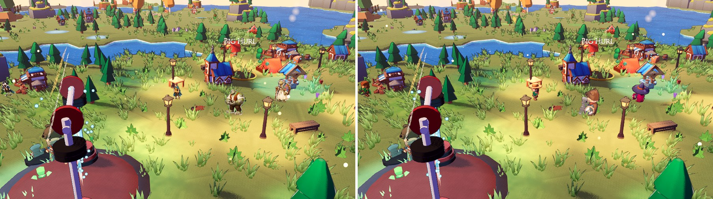
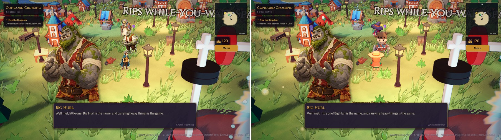

# Papercraft character test

A throw-away test of **paper cut-out characters** standing in the real 3D town: flat art that always faces the camera, with a white paper border, a thickness rim and a soft contact shadow. Nothing in the real game scenes was changed; everything lives in `tests/papercraft/`, `assets/art/paper/` and `tools/`.

## Open and play it

1. Open the project in Godot 4.7.2, open `tests/papercraft/town_square_paper.tscn` and press **F6** (Run Current Scene).
   Command line: `Godot_v4.7.2-stable_win64.exe --path C:\Dev\Deckbuilder-rpg res://tests/papercraft/town_square_paper.tscn`
2. Walk with **WASD / arrows**, talk with **E / Space** (Elder Maren, Foil Fenwick, Big Hurl; Big Hurl stands just east of the well).
3. **P** swaps every character between *paper* and the *current 3D models* instantly (a toast says which). In this scene P no longer opens the packs screen (the HUD button still does).
4. The scene never writes your save (`Session.save_enabled = false` in its `_init`).

Screenshots: `bash tools/shot.sh res://tests/papercraft/town_square_paper.tscn <name> --paper=1|0 --still=1 --at=hurl --cam=x,y,z --nohud=true`; dialogue: `bash tools/dialogue_shots.sh <scene> <prefix> hurl --paper=1|0 --still=1 --cam=...`; side-by-side: `godot -s tools/side_by_side.gd -- left.png right.png out.jpg`.

## How it is built

| Piece | Where |
|---|---|
| Test scene (extends the real `TownScene`; the town is code-built, so inheriting is the faithful "copy" and stays in sync) | `tests/papercraft/town_square_paper.tscn` / `.gd` |
| Paper character (billboard, frames, flip, bob, lean, squash, sway, shadow) | `tests/papercraft/paper_character.gd` |
| Cut-out shader (white border grown from alpha, thickness rim lower-right, catch-light upper-left) | `tests/papercraft/paper_cutout.gdshader` |
| Importer (`bash tools/import_paper_test.sh`) | `tools/import_paper_test.gd` |
| Tests (facing, flip, back view, feet on ground, bob) | `tests/papercraft/test_paper_character.gd` |
| Art | `assets/art/paper/<ID>_<IDLE\|WALK\|BACK>.webp`, 12 files, about 1.3 MB |

- **Import:** the Drive folder `G:\My Drive\Card Game Art\Paper_Test` was **empty**; the 12 files are in the sibling `Paper_test_approved`, so the importer reads `Paper_Test` first and falls back to that folder. Files are copied (read-only) into `_art_inbox/paper_src` (git-ignored). The PNGs already had clean alpha (no gray backdrop; the dark glow in some viewers is colour under alpha 0), so no background was removed; the importer would flood-fill a plain opaque gray corner if one ever appears. Each character is cropped to a shared canvas with the soles on the bottom edge plus a 24 px margin for the border.
- **Facing:** source art faces left; right is the mirror. BACK is used when moving away from the camera. Walking away alternates BACK with its mirror as the two steps.
- **Flip:** any facing change squashes the card to edge-on and opens it out again in 0.15 s (texture swapped at the midpoint).
- **Walking:** IDLE/WALK alternate every 0.17 s, bob of 7.5 % of the figure height, lean up to 8 degrees into the direction of travel, 0.2 s squash on stopping. **Idle:** slow breathing sway (about 1.4 degree roll and 1 % squash).
- **Cast:** the player, Elder Maren, Foil Fenwick (all existing town spots) and Big Hurl (new: a 1.3x Barbarian stands in as his 3D model). The three NPCs wander 0.5 to 1.1 m from their spot now and then, in both modes (the 3D models use their Walking_A clip), and turn to the player when spoken to.
- Cut-outs are as tall as the 3D model they replace (measured from its meshes), the contact shadow is the game's own `ContactShadow`.

## Screenshots (left: paper, right: current 3D models)

**A. Game camera, default angle** (looks down on the square)

**B. Close, over-the-shoulder** (`--cam=0.6,1.3,2.4`)

**C. Low side angle, looking across the square** (`--cam=5.5,2.4,1.6`)

**Dialogue: Big Hurl's portrait beside his paper version** (left: paper, right: 3D)

## What works

- The cut-out look reads immediately in B and the dialogue shot: white border plus thickness rim make the figure pop off the grass, and it matches the painted portraits far better than the chibi 3D models (Big Hurl's town sprite is clearly the same person as his portrait).
- Turning around the vertical axis holds up from every angle, including the low side camera C: the cards never show their edge to the camera.
- Feet sit exactly on the ground (tested), the contact shadow grounds them, and idle sway, bob and squash make them feel alive without any rig or animation clips.
- One art style from card art to portrait to town; new characters need only 3 images and no modeling, rigging or animation.
- Wandering NPCs reuse the same code path, so a talking NPC turning to face you is one `face_toward` call.

## What does not (yet)

- **Scale/proportion clash.** Matching the 3D model's height makes realistic-proportion paper characters stand next to chibi 3D props, buildings and any remaining 3D NPCs; the paper figures look a head bigger and "serious" by comparison. A rollout should switch all characters (and the hero in battle/zones) at once.
- **Unshaded.** The cards ignore the sun and lamp pools, so they look slightly flat and bright at dusk and in dark zones. Needs a tint from the scene's ambient/lamp light (a few lines in the shader) before night scenes.
- **Only three poses and no vertical motion.** No back-walk cycle other than the mirror trick, no attack/interact/emote art; hit reactions would have to be shader/tween effects (flash, shake) rather than animation clips.
- **Border is a screen-space-ish effect.** It is a texture-space outline (width fixed in texels), so it gets thinner on screen with the camera far away (angle A) and thicker in close-ups; angle A shows it barely at all. Fine for a stylised look, but the width should be tied to camera distance if you want a constant line.
- **Mirrored faces/asymmetry.** Mirroring flips anything asymmetric (bags, scars, text, held items); fine for these four, check each new character.
- **Frame swap is coarse.** IDLE/WALK at 0.17 s reads as stop-motion, which suits paper, but the WALK card has the same pose for every direction.
- **Hit-testing, name plates and `NpcHp` bars** still assume the 3D model's height; only the plates were adjusted for Big Hurl in the test.

## Cost of rolling it out to all characters

**Art:** 3 cut-outs per character (IDLE, WALK, BACK), about 100 KB each as lossy WebP at 768 px tall, so about 0.3 MB per character. The game has 58 NPCs plus the hero, villains and bosses: roughly 60 to 80 characters is about 20 to 25 MB of art and 180 to 240 images, plus review on the approval pipeline (the `Approved_Characters` flow works unchanged with a `PAPER-` prefix). Generating consistent left-facing cut-outs with the same pose and scale across the three frames is the real cost; the importer already normalises canvas and feet position.

**Code (about 2 to 3 days):** the importer, shader and `PaperCharacter` exist. Remaining: (1) a `PaperCast` registry mapping town/zone NPC ids to art, replacing `ModelKit.character` in `_add_npc` and the zone builders; (2) hero cosmetics (hat/cloak are 3D bone attachments today: either keep a 3D hero, or generate paper variants per look, or draw hats as separate cards on the same flip pivot); (3) battle and cutscene scenes that use the 3D models; (4) light tint for the shader; (5) retargeting name plates, HP bars and click-picking to the cut-out height; (6) a setting to fall back to 3D models.

**Performance:** measured with `tools/fps.sh` at Medium in this scene (4 characters, 3D vs paper): 69.0 vs 69.1 fps average, p95 14.8 vs 14.6 ms, so no measurable change on the Ryzen 4500U iGPU. Paper saves draw calls: 644 vs 694 (about 12 per 3D character vs about 3 per paper character, 2 meshes plus the shadow) and drops skeleton skinning and an AnimationPlayer per NPC, which is where the real saving is in crowded zones. The shader samples the texture up to 21 times per pixel for the border; on screen a character covers about 100x150 px at the game camera, so it is cheap, but a full-screen close-up (dialogue zoom, cutscenes) would be worth a cheaper two-ring variant or baking the border into the texture at import (recommended for the rollout: bake the white border and rim into the WebP and use a plain unshaded material, which removes the shader cost entirely and lets the importer control the border width).
